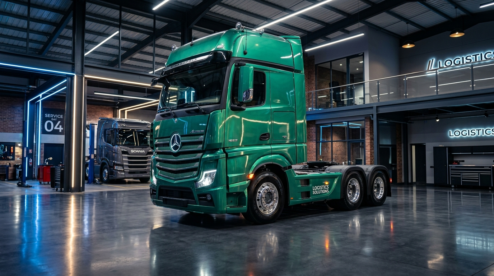

# محاكي الشاحنات الأوروبية - Euro Truck Simulator & Logistics Empire 🚛

محاكاة واقعية ثلاثية الأبعاد لقيادة الشاحنات الأوروبية الثقيلة، ونقل البضائع عبر المدن الأوروبية، وتأسيس وإدارة أسطول لوجستي متكامل.



## 🌟 الميزات الرئيسية (Key Features)

1. **محاكاة القيادة والفيزياء الواقعية (3D Driving Engine)**:
   - مبني بالكامل باستخدام **Three.js** ومسرّع بالـ WebGL.
   - فيزياء حركة ديناميكية تتأثر بوزن الحمولة وحصان المحرك.
   - مقطورة مفصلية حقيقية (Articulated Trailer) تنعطف بسلاسة وتتبع زاوية السحب.
   - زوايا كاميرا متعددة: منظور الكابينة الداخلية (Interior Cockpit)، المنظور الخارجي (Chase Cam)، منظور الصدام الأمامي، والمنظور العلوي.
   - دورة طقس متغيرة: نهار مشمس، غروب أوروبي، مطر مع مساحات زجاجية، ضباب جبال الألب، وليل دامس بأضواء كاشفة.
   - حركة مرور ذكية: سيارات مدنية تتنقل على الطريق السريع.
   - رادارات مراقبة السرعة (80 كم/س) تفرض غرامات فورية في حال التجاوز.

2. **سوق الشحن ونقل البضائع (Freight Market)**:
   - شبكة طرق حقيقية تربط بين مدن أوروبا (برلين، باريس، أمستردام، براغ، ميلانو، فيينا، زيورخ، مدريد، وارسو).
   - أنواع شحنات متعددة: مواد غذائية مبردة، وقود ومواد بترولية خطرة (ADR)، توربينات ومعدات ثقيلة (36 طن)، سيارات رياضية فاخرة، وأجهزة طبية.

3. **إدارة الشركة والأسطول اللوجستي (Logistics Empire)**:
   - شراء شاحنات أوروبية شهيرة (Scania V8, Volvo FH, MAN TGX, Actros).
   - توظيف سائقين محترفين وتعيينهم على الشاحنات لجني أرباح يومية تلقائية.
   - شراء كراجات جديدة في العواصم الأوروبية لزيادة الطاقة الاستيعابية.
   - نظام القروض البنكية لتوسيع الأسطول بسرعة.

4. **ورشة التعديل والتخصيص (Truck Workshop)**:
   - تعديل محاور الهيكل: 4x2، 6x2 مع محور رفع، و 6x4 للأوزان الثقيلة.
   - ترقية المحركات من 420 وحتى 750 حصان V8.
   - نواقل حركة حتى 16 سرعة مع فرامل ريتاردر هيدروليكية.
   - طلاء مخصص، كشافات سقف علوية، دعاميات فولاذية أمامية، وعوادم مزدوجة عمودية.

5. **محرك صوتي واقعي (Web Audio API)**:
   - صوت محرك ديزل حقيقي يتغير تردده مع الـ RPM.
   - تنفيس الفرامل الهوائية (Air Brakes).
   - بوق هوائي مزدوج (Air Horn).
   - أصوات المطر والاصطدامات ومخالفات الرادار.

---

## 🚀 كيفية التثبيت والتشغيل محلياً (How to Run Locally)

### المتطلبات الأساسية:
- **Node.js** (إصدار 18 أو أحدث)
- **npm** أو **pnpm** أو **yarn**

### خطوات التشغيل:
```bash
# 1. تثبيت الحزم والمكتبات
npm install

# 2. تشغيل خادم التطوير المحلي
npm run dev

# 3. بناء النسخة الإنتاجية (Production Build)
npm run build
```

بعد تشغيل الأمر `npm run dev`، افتح المتصفح على:
`http://localhost:3000` أو `http://localhost:5173`

---

## 🎮 أزرار التحكم (Controls)

| الزر | الوظيفة |
| :--- | :--- |
| **W / سهم لأعلى** | دواسة الوقود والتسارع (Throttle) |
| **S / سهم لأسفل** | الفرامل / الرجوع للخلف (Brake / Reverse) |
| **A / D أو الأسهم** | توجيه المقود يساراً ويميناً (Steer Left / Right) |
| **Space (مسافة)** | الفرامل الهوائية واليدوية (Air / Handbrake) |
| **H** | إطلاق بوق الشاحنة (Air Horn) |
| **C** | تبديل زاوية الكاميرا |
| **L** | تشغيل / إيقاف الأضواء الأمامية |
| **P** | تشغيل / إيقاف مساحات الزجاج |
| **E** | تشغيل / إيقاف المحرك |

---

## 📦 التقنيات المستخدمة (Tech Stack)
- **React 19** & **TypeScript**
- **Three.js** (WebGL 3D Rendering)
- **Tailwind CSS v4**
- **Lucide Icons**
- **Web Audio API** (Procedural Audio Synthesis)
- **Vite**
